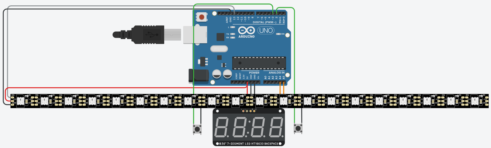

# PING-PONG
Jogo de Ping-Pong criado com um Arduino Uno e uma fita de led NeoPixel.

Este projeto foi um desafio da aula de Automação Aplicada, da Etec Júlio de Mesquita.
## Arquitetura

### Hardware utilizado:
* Fita de LED NeoPixel: Para mostrar o movimento da "bola".
* Display de 7 segmentos: Para mostrar o placar dos jogadores.
* Botões (BTN1 e BTN2): Para interagir com o jogo.

***